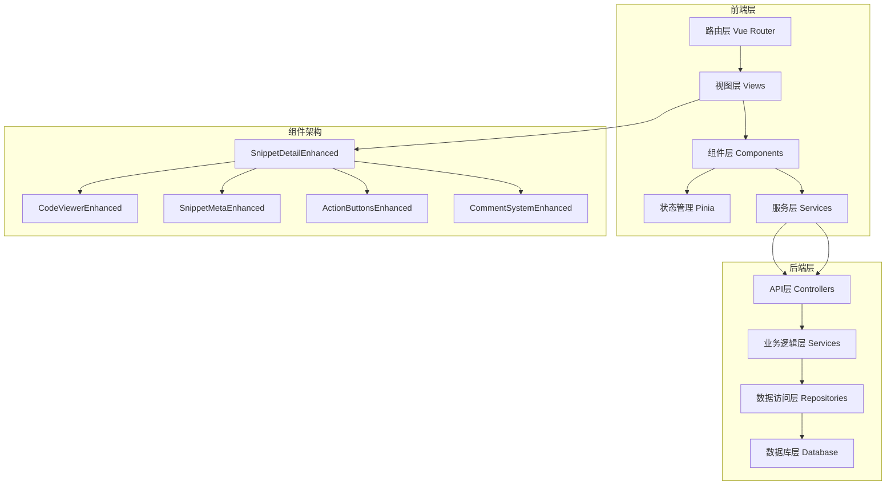
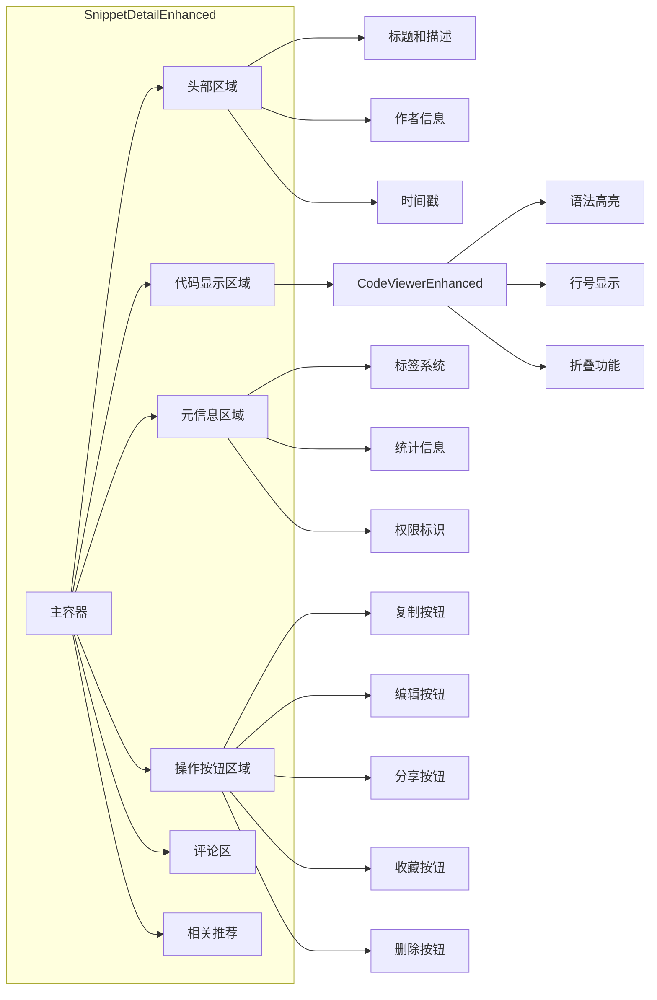
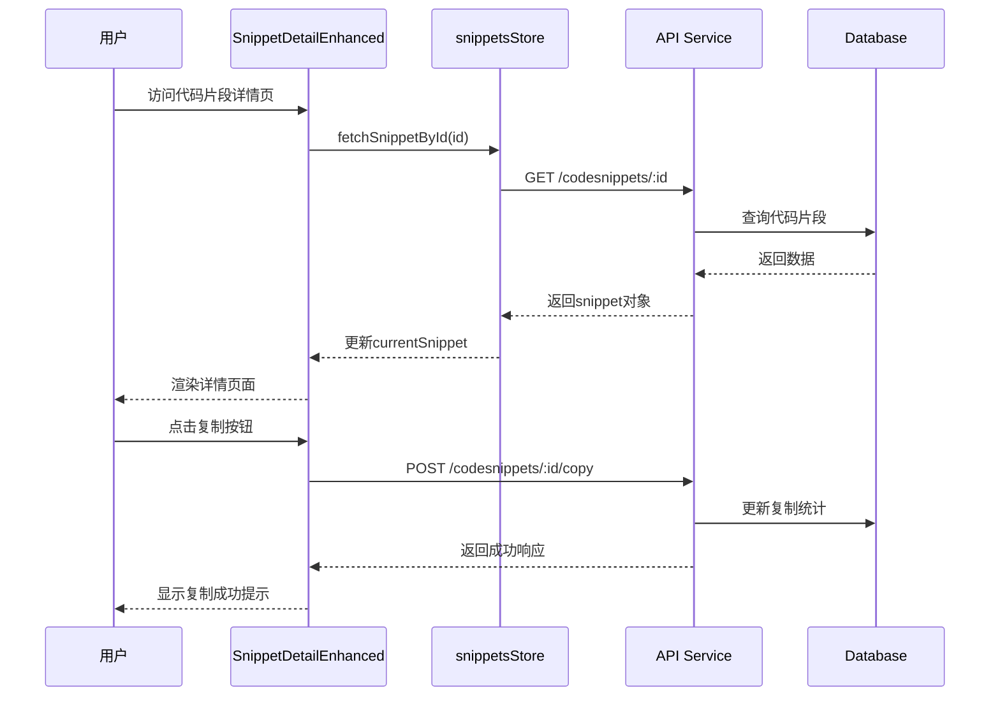
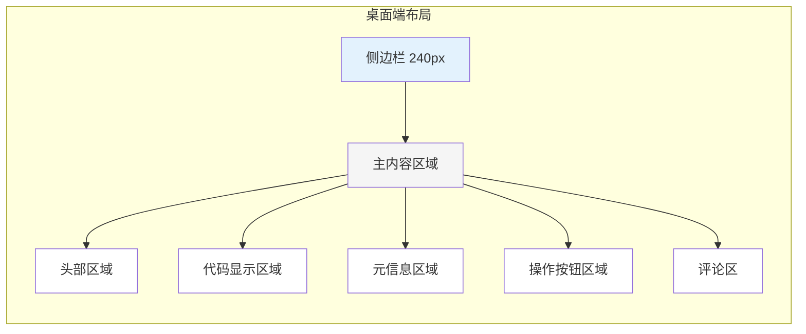
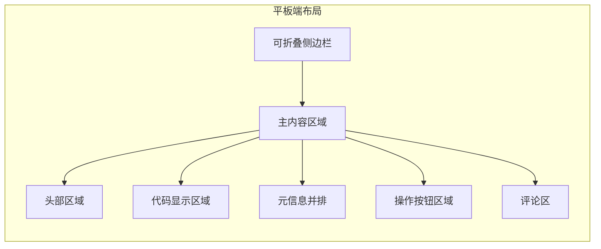
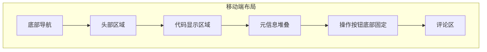
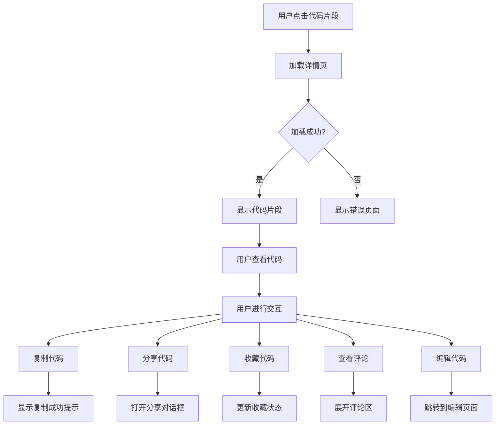
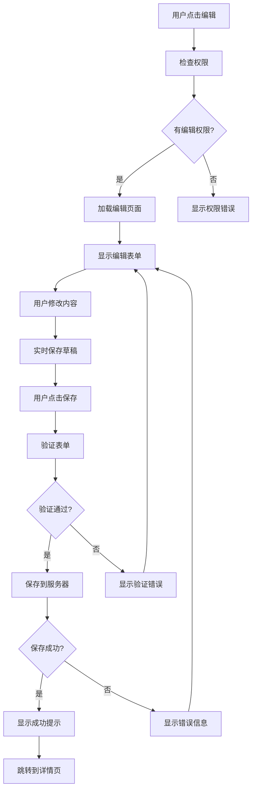

# 代码片段详情页增强功能设计文档

## 1. 设计概述

### 1.1 设计目标 [DES-001]
基于现有的CodeShare架构，重构代码片段详情的查看和编辑页面，实现现代化的用户体验，支持多设备完美适配，优化视觉层次和交互体验。

### 1.2 设计原则 [DES-002]
- **用户中心**：以用户需求为核心，提供直观的交互体验
- **一致性**：遵循现有设计系统，保持视觉和交互的一致性
- **响应式**：移动优先，完美适配所有设备尺寸
- **可访问性**：符合WCAG 2.1 AA标准，支持键盘导航和屏幕阅读器
- **性能优化**：确保快速加载和流畅交互

### 1.3 设计范围 [DES-003]
- 代码片段详情页面的视觉重构
- 代码编辑功能的增强
- 响应式布局优化
- 交互体验提升
- 可访问性改进

## 2. 架构设计

### 2.1 系统架构图



### 2.2 组件架构图



### 2.3 数据流图



## 3. 视觉设计

### 3.1 设计令牌系统

#### 3.1.1 颜色系统 [DES-004]
```css
/* 主色调 */
:root {
  --primary-50: #e3f2fd;
  --primary-100: #bbdefb;
  --primary-200: #90caf9;
  --primary-300: #64b5f6;
  --primary-400: #42a5f5;
  --primary-500: #2196f3;
  --primary-600: #1e88e5;
  --primary-700: #1976d2;
  --primary-800: #1565c0;
  --primary-900: #0d47a1;
}

/* 语义化颜色 */
:root {
  --success: #4caf50;
  --warning: #ff9800;
  --error: #f44336;
  --info: #2196f3;
}

/* 中性色 */
:root {
  --gray-50: #fafafa;
  --gray-100: #f5f5f5;
  --gray-200: #eeeeee;
  --gray-300: #e0e0e0;
  --gray-400: #bdbdbd;
  --gray-500: #9e9e9e;
  --gray-600: #757575;
  --gray-700: #616161;
  --gray-800: #424242;
  --gray-900: #212121;
}
```

#### 3.1.2 间距系统 [DES-005]
```css
/* 基于8px网格系统 */
:root {
  --spacing-xs: 4px;
  --spacing-sm: 8px;
  --spacing-md: 16px;
  --spacing-lg: 24px;
  --spacing-xl: 32px;
  --spacing-2xl: 48px;
  --spacing-3xl: 64px;
}
```

#### 3.1.3 字体系统 [DES-006]
```css
:root {
  /* 字体大小 */
  --font-size-xs: 12px;
  --font-size-sm: 14px;
  --font-size-base: 16px;
  --font-size-lg: 18px;
  --font-size-xl: 20px;
  --font-size-2xl: 24px;
  --font-size-3xl: 32px;
  
  /* 行高 */
  --line-height-tight: 1.25;
  --line-height-snug: 1.375;
  --line-height-normal: 1.5;
  --line-height-relaxed: 1.625;
  --line-height-loose: 2;
  
  /* 字重 */
  --font-weight-light: 300;
  --font-weight-normal: 400;
  --font-weight-medium: 500;
  --font-weight-semibold: 600;
  --font-weight-bold: 700;
}
```

#### 3.1.4 圆角和阴影 [DES-007]
```css
:root {
  /* 圆角 */
  --radius-xs: 4px;
  --radius-sm: 6px;
  --radius-md: 8px;
  --radius-lg: 12px;
  --radius-xl: 16px;
  --radius-2xl: 20px;
  
  /* 阴影 */
  --shadow-sm: 0 1px 2px 0 rgba(0, 0, 0, 0.05);
  --shadow-md: 0 4px 6px -1px rgba(0, 0, 0, 0.1);
  --shadow-lg: 0 10px 15px -3px rgba(0, 0, 0, 0.1);
  --shadow-xl: 0 20px 25px -5px rgba(0, 0, 0, 0.1);
}
```

### 3.2 布局设计

#### 3.2.1 桌面端布局 (1200px+) [DES-008]


#### 3.2.2 平板端布局 (768px-1199px) [DES-009]


#### 3.2.3 移动端布局 (320px-767px) [DES-010]


### 3.3 动画设计

#### 3.3.1 页面转场动画 [DES-011]
```css
/* 页面进入动画 */
.page-enter-active {
  transition: all 0.3s ease-out;
}

.page-enter-from {
  opacity: 0;
  transform: translateY(20px);
}

.page-enter-to {
  opacity: 1;
  transform: translateY(0);
}

/* 页面退出动画 */
.page-leave-active {
  transition: all 0.2s ease-in;
}

.page-leave-from {
  opacity: 1;
  transform: translateY(0);
}

.page-leave-to {
  opacity: 0;
  transform: translateY(-20px);
}
```

#### 3.3.2 组件动画 [DES-012]
```css
/* 卡片出现动画 */
.card-appear {
  animation: cardAppear 0.4s ease-out;
}

@keyframes cardAppear {
  0% {
    opacity: 0;
    transform: translateY(30px) scale(0.95);
  }
  100% {
    opacity: 1;
    transform: translateY(0) scale(1);
  }
}

/* 按钮点击动画 */
.button-press {
  animation: buttonPress 0.2s ease-out;
}

@keyframes buttonPress {
  0% {
    transform: scale(1);
  }
  50% {
    transform: scale(0.95);
  }
  100% {
    transform: scale(1);
  }
}

/* 加载动画 */
.loading-pulse {
  animation: loadingPulse 1.5s ease-in-out infinite;
}

@keyframes loadingPulse {
  0%, 100% {
    opacity: 1;
  }
  50% {
    opacity: 0.3;
  }
}
```

## 4. 组件设计

### 4.1 SnippetDetailEnhanced.vue [DES-013]

#### 4.1.1 组件结构
```vue
<template>
  <div class="snippet-detail-enhanced">
    <!-- 加载状态 -->
    <EnhancedLoading v-if="isLoading" />
    
    <!-- 错误状态 -->
    <ErrorState v-else-if="error" :error="error" @retry="fetchSnippet" />
    
    <!-- 主要内容 -->
    <div v-else class="snippet-content">
      <!-- 头部区域 -->
      <SnippetHeaderEnhanced 
        :snippet="snippet"
        @edit="handleEdit"
        @delete="handleDelete"
      />
      
      <!-- 代码显示区域 -->
      <CodeViewerEnhanced 
        :code="snippet.code"
        :language="snippet.language"
        @copy="handleCopy"
        @fullscreen="handleFullscreen"
      />
      
      <!-- 元信息区域 -->
      <SnippetMetaEnhanced 
        :snippet="snippet"
        @tag-click="handleTagClick"
      />
      
      <!-- 操作按钮区域 -->
      <ActionButtonsEnhanced 
        :snippet="snippet"
        @copy="handleCopy"
        @share="handleShare"
        @favorite="handleFavorite"
      />
      
      <!-- 评论区 -->
      <CommentSystemEnhanced 
        :snippet-id="snippet.id"
        :comments="comments"
        @add-comment="handleAddComment"
      />
      
      <!-- 相关推荐 -->
      <RelatedSnippets 
        :snippets="relatedSnippets"
        @snippet-click="handleSnippetClick"
      />
    </div>
  </div>
</template>
```

#### 4.1.2 Props 定义
```typescript
interface Props {
  snippetId: string
  initialSnippet?: CodeSnippet
}
```

#### 4.1.3 Emits 定义
```typescript
interface Emits {
  (e: 'snippet-loaded', snippet: CodeSnippet): void
  (e: 'snippet-updated', snippet: CodeSnippet): void
  (e: 'snippet-deleted', snippetId: string): void
  (e: 'error', error: Error): void
}
```

### 4.2 CodeViewerEnhanced.vue [DES-014]

#### 4.2.1 功能特性
- **语法高亮**：支持50+编程语言
- **行号显示**：可切换的行号显示
- **代码折叠**：支持代码块折叠
- **全屏模式**：沉浸式代码查看
- **复制功能**：一键复制代码
- **字体大小调节**：支持字体大小缩放
- **主题切换**：亮色/暗色主题

#### 4.2.2 组件实现
```vue
<template>
  <div class="code-viewer-enhanced">
    <!-- 工具栏 -->
    <div class="code-toolbar">
      <div class="toolbar-left">
        <LanguageBadge :language="language" />
        <span class="code-info">{{ lineCount }} lines</span>
      </div>
      
      <div class="toolbar-right">
        <Button 
          variant="ghost" 
          size="sm"
          @click="toggleLineNumbers"
          :title="showLineNumbers ? '隐藏行号' : '显示行号'"
        >
          <Icon :name="showLineNumbers ? 'hash' : 'hash-off'" />
        </Button>
        
        <Button 
          variant="ghost" 
          size="sm"
          @click="decreaseFontSize"
          :disabled="fontSize <= 12"
          title="减小字体"
        >
          <Icon name="minus" />
        </Button>
        
        <span class="font-size-display">{{ fontSize }}px</span>
        
        <Button 
          variant="ghost" 
          size="sm"
          @click="increaseFontSize"
          :disabled="fontSize >= 24"
          title="增大字体"
        >
          <Icon name="plus" />
        </Button>
        
        <Button 
          variant="ghost" 
          size="sm"
          @click="toggleFullscreen"
          title="全屏查看"
        >
          <Icon :name="isFullscreen ? 'minimize' : 'maximize'" />
        </Button>
        
        <Button 
          variant="primary" 
          size="sm"
          @click="copyCode"
          :loading="isCopying"
        >
          <Icon :name="isCopied ? 'check' : 'copy'" />
          {{ isCopied ? '已复制' : '复制' }}
        </Button>
      </div>
    </div>
    
    <!-- 代码显示区域 -->
    <div 
      class="code-display"
      :class="{ 
        'fullscreen': isFullscreen,
        'show-line-numbers': showLineNumbers 
      }"
      :style="{ fontSize: fontSize + 'px' }"
    >
      <pre><code :class="languageClass" v-html="highlightedCode"></code></pre>
    </div>
  </div>
</template>
```

### 4.3 SnippetMetaEnhanced.vue [DES-015]

#### 4.3.1 组件布局
```vue
<template>
  <div class="snippet-meta-enhanced">
    <!-- 标签区域 -->
    <div class="tags-section">
      <h3 class="section-title">标签</h3>
      <div class="tags-container">
        <TagChip
          v-for="tag in snippet.tags"
          :key="tag.id"
          :tag="tag"
          @click="$emit('tag-click', tag)"
        />
        <Button
          v-if="canEdit"
          variant="ghost"
          size="sm"
          @click="editTags"
        >
          <Icon name="plus" />
          添加标签
        </Button>
      </div>
    </div>
    
    <!-- 统计信息 -->
    <div class="stats-section">
      <h3 class="section-title">统计信息</h3>
      <div class="stats-grid">
        <StatCard
          icon="eye"
          label="查看次数"
          :value="snippet.viewCount"
          color="blue"
        />
        <StatCard
          icon="copy"
          label="复制次数"
          :value="snippet.copyCount"
          color="green"
        />
        <StatCard
          icon="share"
          label="分享次数"
          :value="snippet.shareCount"
          color="purple"
        />
        <StatCard
          icon="heart"
          label="收藏次数"
          :value="snippet.favoriteCount"
          color="red"
        />
      </div>
    </div>
    
    <!-- 权限信息 -->
    <div class="permissions-section">
      <h3 class="section-title">权限设置</h3>
      <div class="permission-info">
        <Icon 
          :name="snippet.isPublic ? 'globe' : 'lock'"
          :class="['permission-icon', snippet.isPublic ? 'public' : 'private']"
        />
        <span class="permission-text">
          {{ snippet.isPublic ? '公开' : '私有' }}
        </span>
        <Button
          v-if="canEdit"
          variant="ghost"
          size="sm"
          @click="editPermissions"
        >
          编辑
        </Button>
      </div>
    </div>
    
    <!-- 时间信息 -->
    <div class="time-section">
      <h3 class="section-title">时间信息</h3>
      <div class="time-info">
        <div class="time-item">
          <Icon name="calendar-plus" />
          <span>创建于 {{ formatDate(snippet.createdAt) }}</span>
        </div>
        <div class="time-item">
          <Icon name="calendar-edit" />
          <span>更新于 {{ formatDate(snippet.updatedAt) }}</span>
        </div>
        <div v-if="snippet.lastSharedAt" class="time-item">
          <Icon name="share" />
          <span>最后分享于 {{ formatDate(snippet.lastSharedAt) }}</span>
        </div>
      </div>
    </div>
  </div>
</template>
```

## 5. 交互设计

### 5.1 用户流程图

#### 5.1.1 查看代码片段流程 [DES-016]


#### 5.1.2 编辑代码片段流程 [DES-017]


### 5.2 交互状态设计

#### 5.2.1 加载状态 [DES-018]
```vue
<template>
  <div class="loading-state">
    <div class="loading-skeleton">
      <!-- 标题骨架 -->
      <div class="skeleton-title"></div>
      
      <!-- 代码区域骨架 -->
      <div class="skeleton-code">
        <div class="skeleton-line" v-for="i in 15" :key="i"></div>
      </div>
      
      <!-- 元信息骨架 -->
      <div class="skeleton-meta">
        <div class="skeleton-tag" v-for="i in 3" :key="i"></div>
      </div>
    </div>
  </div>
</template>
```

#### 5.2.2 错误状态 [DES-019]
```vue
<template>
  <div class="error-state">
    <div class="error-icon">
      <Icon name="alert-circle" size="48" />
    </div>
    
    <h2 class="error-title">加载失败</h2>
    
    <p class="error-message">
      {{ error.message || '无法加载代码片段，请稍后重试' }}
    </p>
    
    <div class="error-actions">
      <Button @click="retry">重试</Button>
      <Button variant="outline" @click="goHome">返回首页</Button>
    </div>
    
    <div v-if="showDetails" class="error-details">
      <details>
        <summary>错误详情</summary>
        <pre>{{ error.stack }}</pre>
      </details>
    </div>
  </div>
</template>
```

#### 5.2.3 空状态 [DES-020]
```vue
<template>
  <div class="empty-state">
    <div class="empty-icon">
      <Icon name="code" size="64" />
    </div>
    
    <h2 class="empty-title">暂无代码片段</h2>
    
    <p class="empty-description">
      该代码片段不存在或已被删除
    </p>
    
    <div class="empty-actions">
      <Button @click="createNew">创建代码片段</Button>
      <Button variant="outline" @click="browseSnippets">浏览代码片段</Button>
    </div>
  </div>
</template>
```

## 6. 响应式设计

### 6.1 断点系统 [DES-021]

```css
/* 移动端: 320px - 767px */
@media (max-width: 767px) {
  .snippet-detail-enhanced {
    padding: var(--spacing-md);
  }
  
  .code-viewer-enhanced {
    margin: calc(-1 * var(--spacing-md));
    border-radius: 0;
  }
  
  .action-buttons-enhanced {
    position: fixed;
    bottom: 0;
    left: 0;
    right: 0;
    background: white;
    border-top: 1px solid var(--gray-200);
    padding: var(--spacing-md);
    z-index: 100;
  }
}

/* 平板端: 768px - 1199px */
@media (min-width: 768px) and (max-width: 1199px) {
  .snippet-detail-enhanced {
    padding: var(--spacing-lg);
  }
  
  .snippet-meta-enhanced {
    display: grid;
    grid-template-columns: 1fr 1fr;
    gap: var(--spacing-lg);
  }
}

/* 桌面端: 1200px+ */
@media (min-width: 1200px) {
  .snippet-detail-enhanced {
    max-width: 1200px;
    margin: 0 auto;
    padding: var(--spacing-2xl);
  }
  
  .snippet-content {
    display: grid;
    grid-template-columns: 1fr 300px;
    gap: var(--spacing-2xl);
  }
  
  .snippet-main {
    grid-column: 1;
  }
  
  .snippet-sidebar {
    grid-column: 2;
    position: sticky;
    top: var(--spacing-lg);
  }
}
```

### 6.2 触摸优化 [DES-022]

```css
/* 触摸目标大小 */
@media (hover: none) {
  .button,
  .tag-chip,
  .stat-card {
    min-height: 44px;
    min-width: 44px;
  }
  
  /* 增加间距 */
  .action-buttons-enhanced {
    gap: var(--spacing-md);
  }
  
  /* 防止误触 */
  .code-viewer-enhanced {
    user-select: none;
    -webkit-user-select: none;
  }
  
  /* 触摸反馈 */
  .button:active {
    transform: scale(0.95);
  }
}
```

## 7. 可访问性设计

### 7.1 语义化HTML [DES-023]

```vue
<template>
  <article class="snippet-detail-enhanced">
    <header class="snippet-header">
      <h1 class="snippet-title">{{ snippet.title }}</h1>
      <div class="snippet-description">
        <p>{{ snippet.description }}</p>
      </div>
    </header>
    
    <section class="code-section" aria-label="代码内容">
      <div 
        class="code-container"
        role="region"
        aria-label="代码编辑器"
        tabindex="0"
      >
        <pre><code :class="languageClass">{{ code }}</code></pre>
      </div>
    </section>
    
    <section class="meta-section" aria-label="元信息">
      <h2>代码信息</h2>
      <!-- 元信息内容 -->
    </section>
    
    <section class="comments-section" aria-label="评论">
      <h2>评论</h2>
      <!-- 评论内容 -->
    </section>
  </article>
</template>
```

### 7.2 键盘导航 [DES-024]

```typescript
// 键盘快捷键支持
const keyboardShortcuts = {
  'Ctrl+C': handleCopy,
  'Cmd+C': handleCopy,
  'Ctrl+F': handleSearch,
  'Cmd+F': handleSearch,
  'Ctrl+E': handleEdit,
  'Cmd+E': handleEdit,
  'F11': handleFullscreen,
  'Escape': closeFullscreen,
  'ArrowUp': navigateUp,
  'ArrowDown': navigateDown,
}

// 监听键盘事件
onMounted(() => {
  const handleKeyDown = (event: KeyboardEvent) => {
    const key = `${event.ctrlKey || event.metaKey ? 'Ctrl' : ''}${event.shiftKey ? 'Shift' : ''}${event.key}`
    
    if (keyboardShortcuts[key]) {
      event.preventDefault()
      keyboardShortcuts[key]()
    }
  }
  
  window.addEventListener('keydown', handleKeyDown)
  
  onUnmounted(() => {
    window.removeEventListener('keydown', handleKeyDown)
  })
})
```

### 7.3 屏幕阅读器支持 [DES-025]

```vue
<template>
  <div class="snippet-detail-enhanced">
    <!-- 跳转到主要内容的链接 -->
    <a href="#main-content" class="skip-link">跳转到主要内容</a>
    
    <!-- 主要内容 -->
    <main id="main-content" role="main">
      <!-- 内容区域 -->
    </main>
    
    <!-- 实时区域用于屏幕阅读器 -->
    <div 
      aria-live="polite" 
      aria-atomic="true"
      class="sr-only"
    >
      {{ screenReaderMessage }}
    </div>
  </div>
</template>
```

## 8. 性能优化

### 8.1 懒加载和代码分割 [DES-026]

```typescript
// 组件懒加载
const CodeViewerEnhanced = defineAsyncComponent(() => 
  import('./CodeViewerEnhanced.vue')
)

const CommentSystemEnhanced = defineAsyncComponent(() => 
  import('./CommentSystemEnhanced.vue')
)

// 路由懒加载
const routes = [
  {
    path: '/snippets/:id',
    name: 'snippet-detail',
    component: () => import('@/views/SnippetDetailView.vue'),
    props: true
  }
]
```

### 8.2 虚拟滚动 [DES-027]

```vue
<template>
  <div class="comments-section">
    <VirtualScroller
      :items="comments"
      :item-size="100"
      :buffer="10"
      class="comments-list"
    >
      <template #default="{ item: comment }">
        <CommentItem 
          :comment="comment"
          :key="comment.id"
        />
      </template>
    </VirtualScroller>
  </div>
</template>
```

### 8.3 缓存策略 [DES-028]

```typescript
// 使用Pinia缓存
const useSnippetStore = defineStore('snippets', {
  state: () => ({
    snippets: new Map<string, CodeSnippet>(),
    cache: new Map<string, { data: CodeSnippet, timestamp: number }>()
  }),
  
  actions: {
    async fetchSnippet(id: string) {
      // 检查缓存
      const cached = this.cache.get(id)
      if (cached && Date.now() - cached.timestamp < 5 * 60 * 1000) {
        return cached.data
      }
      
      // 获取数据
      const snippet = await snippetService.getById(id)
      
      // 缓存数据
      this.cache.set(id, {
        data: snippet,
        timestamp: Date.now()
      })
      
      return snippet
    }
  }
})
```

## 9. 测试策略

### 9.1 单元测试 [DES-029]

```typescript
// SnippetDetailEnhanced.spec.ts
import { mount } from '@vue/test-utils'
import { describe, it, expect, vi } from 'vitest'
import SnippetDetailEnhanced from './SnippetDetailEnhanced.vue'

describe('SnippetDetailEnhanced', () => {
  const mockSnippet = {
    id: '1',
    title: 'Test Snippet',
    description: 'Test description',
    code: 'console.log("Hello, World!")',
    language: 'javascript',
    // ...其他属性
  }

  it('renders snippet correctly', () => {
    const wrapper = mount(SnippetDetailEnhanced, {
      props: {
        snippetId: '1',
        initialSnippet: mockSnippet
      }
    })

    expect(wrapper.find('.snippet-title').text()).toBe('Test Snippet')
    expect(wrapper.find('.snippet-description').text()).toBe('Test description')
  })

  it('emits copy event when copy button is clicked', async () => {
    const wrapper = mount(SnippetDetailEnhanced, {
      props: {
        snippetId: '1',
        initialSnippet: mockSnippet
      }
    })

    await wrapper.find('.copy-button').trigger('click')
    expect(wrapper.emitted('copy')).toBeTruthy()
  })
})
```

### 9.2 集成测试 [DES-030]

```typescript
// snippet-detail.integration.spec.ts
import { render, screen, fireEvent, waitFor } from '@testing-library/vue'
import { describe, it, expect } from 'vitest'
import SnippetDetailEnhanced from '@/components/SnippetDetailEnhanced.vue'

describe('SnippetDetailEnhanced Integration', () => {
  it('loads and displays snippet data', async () => {
    render(SnippetDetailEnhanced, {
      props: { snippetId: '1' }
    })

    // 等待数据加载
    await waitFor(() => {
      expect(screen.getByText('Test Snippet')).toBeInTheDocument()
    })
  })

  it('handles copy functionality', async () => {
    render(SnippetDetailEnhanced, {
      props: { snippetId: '1' }
    })

    const copyButton = screen.getByText('复制')
    await fireEvent.click(copyButton)

    await waitFor(() => {
      expect(screen.getByText('已复制')).toBeInTheDocument()
    })
  })
})
```

### 9.3 E2E测试 [DES-031]

```typescript
// snippet-detail.e2e.spec.ts
import { test, expect } from '@playwright/test'

test.describe('Snippet Detail Page', () => {
  test('should display snippet correctly', async ({ page }) => {
    await page.goto('/snippets/1')
    
    await expect(page.locator('.snippet-title')).toBeVisible()
    await expect(page.locator('.code-viewer')).toBeVisible()
    await expect(page.locator('.meta-section')).toBeVisible()
  })

  test('should copy code to clipboard', async ({ page }) => {
    await page.goto('/snippets/1')
    
    await page.click('.copy-button')
    
    // 验证剪贴板内容
    const clipboardText = await page.evaluate(() => 
      navigator.clipboard.readText()
    )
    expect(clipboardText).toContain('console.log')
  })

  test('should be responsive on mobile', async ({ page }) => {
    await page.goto('/snippets/1')
    await page.setViewportSize({ width: 375, height: 667 })
    
    await expect(page.locator('.action-buttons')).toBeVisible()
    await expect(page.locator('.mobile-nav')).toBeVisible()
  })
})
```

## 10. 部署和监控

### 10.1 构建配置 [DES-032]

```javascript
// vite.config.js
export default defineConfig({
  build: {
    rollupOptions: {
      output: {
        manualChunks: {
          vendor: ['vue', 'vue-router', 'pinia'],
          editor: ['monaco-editor'],
          utils: ['lodash-es', 'dayjs']
        }
      }
    },
    chunkSizeWarningLimit: 1000
  },
  
  // 生产环境优化
  esbuild: {
    pure: ['console.log', 'debugger']
  }
})
```

### 10.2 性能监控 [DES-033]

```typescript
// 性能监控
const performanceMonitor = {
  // 页面加载时间
  measurePageLoad: () => {
    const navigation = performance.getEntriesByType('navigation')[0]
    return {
      domComplete: navigation.domComplete,
      loadEventEnd: navigation.loadEventEnd
    }
  },
  
  // 组件渲染时间
  measureComponentRender: (componentName: string) => {
    const start = performance.now()
    // 组件渲染逻辑
    const end = performance.now()
    return end - start
  },
  
  // 用户交互延迟
  measureInteraction: () => {
    const observer = new PerformanceObserver((list) => {
      const entries = list.getEntries()
      entries.forEach(entry => {
        if (entry.duration > 100) {
          console.warn('Slow interaction:', entry)
        }
      })
    })
    
    observer.observe({ entryTypes: ['first-input', 'largest-contentful-paint'] })
  }
}
```

### 10.3 错误监控 [DES-034]

```typescript
// 全局错误处理
const errorHandler = {
  // Vue错误处理
  vueErrorHandler: (error: Error, instance: any, info: string) => {
    console.error('Vue Error:', error)
    
    // 发送到错误监控服务
    errorReportingService.captureException(error, {
      componentName: instance?.$options?.name,
      errorInfo: info
    })
  },
  
  // Promise错误处理
  unhandledRejectionHandler: (event: PromiseRejectionEvent) => {
    console.error('Unhandled Rejection:', event.reason)
    
    errorReportingService.captureException(event.reason, {
      type: 'unhandledRejection'
    })
  },
  
  // 网络错误处理
  networkErrorHandler: (error: Error) => {
    console.error('Network Error:', error)
    
    errorReportingService.captureException(error, {
      type: 'networkError'
    })
  }
}

// 注册错误处理器
app.config.errorHandler = errorHandler.vueErrorHandler
window.addEventListener('unhandledrejection', errorHandler.unhandledRejectionHandler)
```

## 11. 设计规范和指南

### 11.1 组件设计规范 [DES-035]

#### 命名约定
- 组件文件：PascalCase (e.g., `SnippetDetailEnhanced.vue`)
- Props：camelCase (e.g., `snippetId`)
- Events：kebab-case (e.g., `snippet-loaded`)
- CSS类：kebab-case (e.g., `snippet-detail-enhanced`)

#### 组件结构
```vue
<template>
  <!-- 模板结构 -->
</template>

<script setup lang="ts">
  // 导入语句
  import { ref, computed, onMounted } from 'vue'
  
  // Props定义
  interface Props {
    // ...
  }
  
  const props = defineProps<Props>()
  
  // Emits定义
  const emit = defineEmits<{
    // ...
  }>()
  
  // 状态管理
  const state = ref({})
  
  // 计算属性
  const computedValue = computed(() => {})
  
  // 方法
  const method = () => {}
  
  // 生命周期
  onMounted(() => {})
</script>

<style scoped>
  /* 样式定义 */
</style>
```

### 11.2 样式指南 [DES-036]

#### CSS组织
- 使用CSS变量定义设计令牌
- 遵循BEM命名规范
- 使用scoped样式避免冲突
- 优先使用Tailwind CSS类

#### 响应式设计
- 移动优先设计方法
- 使用相对单位（rem、em、%）
- 合理的断点设置
- 触摸友好的交互设计

### 11.3 性能指南 [DES-037]

#### 组件优化
- 使用`v-once`优化静态内容
- 合理使用`v-memo`减少不必要渲染
- 避免深层嵌套组件
- 使用`shallowRef`和`shallowReactive`优化大型对象

#### 资源优化
- 图片懒加载和压缩
- 字体文件优化
- 第三方库按需加载
- 合理使用缓存策略

## 12. 风险评估和缓解策略

### 12.1 技术风险 [DES-038]

#### Monaco Editor集成风险
- **风险**：Monaco Editor包体积大，影响加载性能
- **缓解**：代码分割、懒加载、使用Web Worker

#### 移动端性能风险
- **风险**：代码编辑器在移动端性能不佳
- **缓解**：简化移动端功能、优化触摸交互

#### 浏览器兼容性风险
- **风险**：部分浏览器不支持某些现代特性
- **缓解**：渐进增强、polyfill、优雅降级

### 12.2 用户体验风险 [DES-039]

#### 学习成本风险
- **风险**：新界面需要用户适应
- **缓解**：提供引导教程、保持部分原有习惯

#### 性能期望风险
- **风险**：用户对加载速度期望过高
- **缓解**：优化加载动画、设置合理期望

### 12.3 项目风险 [DES-040]

#### 开发时间风险
- **风险**：功能复杂度超出预期
- **缓解**：分阶段开发、MVP优先

#### 维护成本风险
- **风险**：代码复杂度增加维护难度
- **缓解**：保持代码质量、完善文档

## 13. 总结

本设计文档为"代码片段详情页增强功能"提供了完整的设计方案，涵盖了：

### 13.1 设计优势

1. **用户中心设计**：以用户体验为核心，提供直观的交互
2. **技术可行性**：基于现有架构，实施风险可控
3. **响应式设计**：完美适配所有设备尺寸
4. **可访问性**：符合WCAG 2.1 AA标准
5. **性能优化**：多种优化策略确保良好性能
6. **可维护性**：清晰的代码结构和完善的文档

### 13.2 创新点

1. **增强的代码查看器**：支持语法高亮、行号、折叠等功能
2. **流畅的交互体验**：丰富的动画和微交互
3. **智能的响应式布局**：根据设备特性自动调整
4. **完善的可访问性**：支持键盘导航和屏幕阅读器
5. **性能监控体系**：实时监控和优化性能

### 13.3 实施建议

1. **分阶段实施**：先实现核心功能，再添加高级功能
2. **用户测试**：在开发过程中进行用户测试
3. **性能监控**：持续监控性能指标
4. **文档维护**：保持文档的及时更新

本设计文档为开发团队提供了清晰的指导，确保项目能够高质量、高效率地完成。