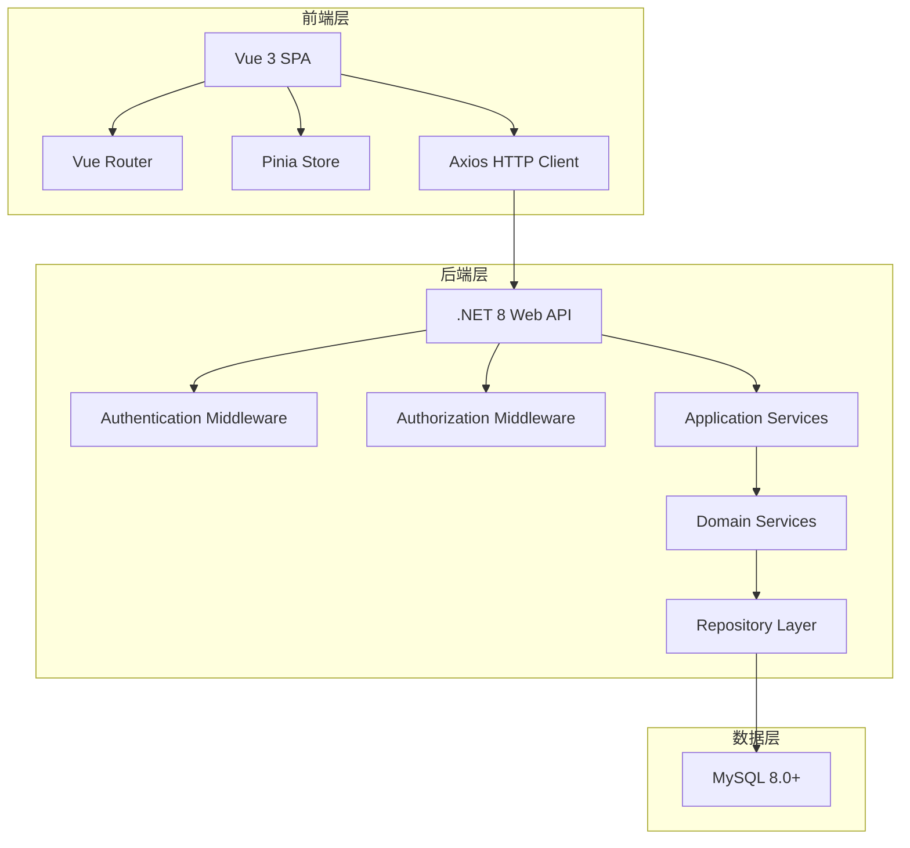
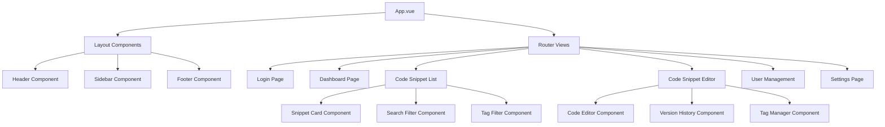
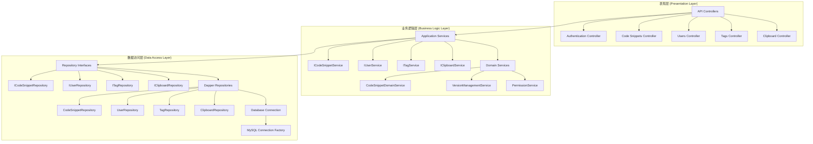

# 设计文档

## 概述

代码片段管理工具采用前后端分离的架构设计，前端使用 Vue 3 + Composition API 构建现代化的单页应用，后端使用 .NET 8 Web API 遵循三层架构设计和六大设计原则提供 RESTful 服务，数据访问层使用 Dapper ORM，数据存储使用 MySQL 8.0+ 数据库。系统支持多用户权限管理、代码片段的 CRUD 操作、版本控制、标签分类和剪贴板历史功能。

## 架构

### 六大设计原则应用

本项目严格遵循面向对象设计的六大原则：

1. **单一职责原则 (SRP)**: 每个类只负责一个功能领域
   - Controller 只负责 HTTP 请求处理
   - Service 只负责业务逻辑
   - Repository 只负责数据访问

2. **开闭原则 (OCP)**: 对扩展开放，对修改关闭
   - 通过接口定义抽象，便于扩展新的实现
   - 使用策略模式处理不同的业务场景

3. **里氏替换原则 (LSP)**: 子类可以替换父类
   - 所有实现类都能完全替换其接口
   - 保证多态性的正确使用

4. **接口隔离原则 (ISP)**: 接口应该小而专一
   - 将大接口拆分为多个小接口
   - 客户端不依赖不需要的接口

5. **依赖倒置原则 (DIP)**: 依赖抽象而非具体实现
   - 高层模块不依赖低层模块
   - 通过依赖注入实现控制反转

6. **迪米特法则 (LoD)**: 最少知识原则
   - 对象只与直接朋友通信
   - 减少类之间的耦合度

### 面向对象和接口开发原则

本项目严格遵循面向对象编程和面向接口开发：

1. **面向接口编程**: 所有业务逻辑都通过接口定义契约
2. **依赖注入**: 使用 .NET 内置 DI 容器管理对象生命周期
3. **控制反转**: 高层模块不依赖低层模块的具体实现
4. **生命周期管理**: 
   - Singleton: 数据库连接工厂
   - Scoped: 业务服务和仓储
   - Transient: 轻量级服务

### 整体架构



### 技术栈

- **前端**: Vue 3, Vue Router, Pinia, Axios, Vite
- **后端**: .NET 8, ASP.NET Core Web API, 三层架构设计
- **数据访问**: Dapper ORM
- **数据库**: MySQL 8.0+
- **认证**: JWT Token
- **API 文档**: Swagger/OpenAPI
- **设计原则**: 遵循六大设计原则 (单一职责、开闭原则、里氏替换、接口隔离、依赖倒置、迪米特法则)
- **开发模式**: 面向对象编程 (OOP)、面向接口编程
- **生命周期管理**: .NET 依赖注入容器 (DI Container)

## 组件和接口

### 前端组件架构



### 后端三层架构设计



### 核心接口定义

#### 前端 API 接口

```typescript
// 认证接口
interface AuthAPI {
  login(credentials: LoginRequest): Promise<AuthResponse>;
  logout(): Promise<void>;
  refreshToken(): Promise<AuthResponse>;
  getCurrentUser(): Promise<User>;
}

// 代码片段接口
interface CodeSnippetAPI {
  getSnippets(filter: SnippetFilter): Promise<PaginatedResult<CodeSnippet>>;
  getSnippet(id: string): Promise<CodeSnippet>;
  createSnippet(snippet: CreateSnippetRequest): Promise<CodeSnippet>;
  updateSnippet(
    id: string,
    snippet: UpdateSnippetRequest
  ): Promise<CodeSnippet>;
  deleteSnippet(id: string): Promise<void>;
  getVersionHistory(id: string): Promise<SnippetVersion[]>;
  restoreVersion(id: string, versionId: string): Promise<CodeSnippet>;
}

// 标签接口
interface TagAPI {
  getTags(): Promise<Tag[]>;
  createTag(tag: CreateTagRequest): Promise<Tag>;
  updateTag(id: string, tag: UpdateTagRequest): Promise<Tag>;
  deleteTag(id: string): Promise<void>;
}
```

#### 后端三层架构接口设计

```csharp
// 表现层 - 控制器 (遵循单一职责原则)
[ApiController]
[Route("api/[controller]")]
[Authorize]
public class CodeSnippetsController : ControllerBase
{
    private readonly ICodeSnippetService _codeSnippetService;
    
    public CodeSnippetsController(ICodeSnippetService codeSnippetService)
    {
        _codeSnippetService = codeSnippetService;
    }

    [HttpGet]
    public async Task<PaginatedResult<CodeSnippetDto>> GetSnippets([FromQuery] SnippetFilterDto filter)
        => await _codeSnippetService.GetSnippetsAsync(filter);

    [HttpPost]
    public async Task<CodeSnippetDto> CreateSnippet([FromBody] CreateSnippetDto snippet)
        => await _codeSnippetService.CreateSnippetAsync(snippet);
}

// 业务逻辑层 - 应用服务接口 (遵循接口隔离原则)
public interface ICodeSnippetService
{
    Task<PaginatedResult<CodeSnippetDto>> GetSnippetsAsync(SnippetFilterDto filter);
    Task<CodeSnippetDto> GetSnippetAsync(Guid id);
    Task<CodeSnippetDto> CreateSnippetAsync(CreateSnippetDto snippet);
    Task<CodeSnippetDto> UpdateSnippetAsync(Guid id, UpdateSnippetDto snippet);
    Task<bool> DeleteSnippetAsync(Guid id);
}

// 业务逻辑层 - 应用服务实现 (遵循依赖倒置原则)
public class CodeSnippetService : ICodeSnippetService
{
    private readonly ICodeSnippetRepository _repository;
    private readonly IVersionManagementService _versionService;
    
    public CodeSnippetService(
        ICodeSnippetRepository repository,
        IVersionManagementService versionService)
    {
        _repository = repository;
        _versionService = versionService;
    }
    
    public async Task<CodeSnippetDto> CreateSnippetAsync(CreateSnippetDto snippet)
    {
        // 业务逻辑处理
        var entity = MapToEntity(snippet);
        var created = await _repository.CreateAsync(entity);
        await _versionService.CreateInitialVersionAsync(created.Id);
        return MapToDto(created);
    }
}

// 数据访问层 - 仓储接口 (遵循开闭原则)
public interface ICodeSnippetRepository
{
    Task<CodeSnippet> GetByIdAsync(Guid id);
    Task<PaginatedResult<CodeSnippet>> GetPagedAsync(SnippetFilter filter);
    Task<CodeSnippet> CreateAsync(CodeSnippet snippet);
    Task<CodeSnippet> UpdateAsync(CodeSnippet snippet);
    Task<bool> DeleteAsync(Guid id);
}

// 数据访问层 - Dapper 仓储实现
public class CodeSnippetRepository : ICodeSnippetRepository
{
    private readonly IDbConnectionFactory _connectionFactory;
    
    public CodeSnippetRepository(IDbConnectionFactory connectionFactory)
    {
        _connectionFactory = connectionFactory;
    }
    
    public async Task<CodeSnippet> GetByIdAsync(Guid id)
    {
        using var connection = _connectionFactory.CreateConnection();
        const string sql = @"
            SELECT cs.*, u.Username as CreatorName 
            FROM CodeSnippets cs 
            LEFT JOIN Users u ON cs.CreatedBy = u.Id 
            WHERE cs.Id = @Id";
        
        return await connection.QuerySingleOrDefaultAsync<CodeSnippet>(sql, new { Id = id });
    }
    
    public async Task<CodeSnippet> CreateAsync(CodeSnippet snippet)
    {
        using var connection = _connectionFactory.CreateConnection();
        const string sql = @"
            INSERT INTO CodeSnippets (Id, Title, Description, Code, Language, CreatedBy, CreatedAt, UpdatedAt, IsPublic)
            VALUES (@Id, @Title, @Description, @Code, @Language, @CreatedBy, @CreatedAt, @UpdatedAt, @IsPublic)";
        
        await connection.ExecuteAsync(sql, snippet);
        return snippet;
    }
}
```

## 数据模型

### 数据库设计

```sql
-- 用户表
CREATE TABLE Users (
    Id CHAR(36) PRIMARY KEY,
    Username VARCHAR(50) UNIQUE NOT NULL,
    Email VARCHAR(100) UNIQUE NOT NULL,
    PasswordHash VARCHAR(255) NOT NULL,
    Role ENUM('Admin', 'Editor', 'Viewer') NOT NULL DEFAULT 'Viewer',
    CreatedAt TIMESTAMP DEFAULT CURRENT_TIMESTAMP,
    UpdatedAt TIMESTAMP DEFAULT CURRENT_TIMESTAMP ON UPDATE CURRENT_TIMESTAMP,
    IsActive BOOLEAN DEFAULT TRUE
);

-- 代码片段表
CREATE TABLE CodeSnippets (
    Id CHAR(36) PRIMARY KEY,
    Title VARCHAR(200) NOT NULL,
    Description TEXT,
    Code LONGTEXT NOT NULL,
    Language VARCHAR(50) NOT NULL,
    CreatedBy CHAR(36) NOT NULL,
    CreatedAt TIMESTAMP DEFAULT CURRENT_TIMESTAMP,
    UpdatedAt TIMESTAMP DEFAULT CURRENT_TIMESTAMP ON UPDATE CURRENT_TIMESTAMP,
    IsPublic BOOLEAN DEFAULT FALSE,
    ViewCount INT DEFAULT 0,
    CopyCount INT DEFAULT 0,
    FOREIGN KEY (CreatedBy) REFERENCES Users(Id) ON DELETE CASCADE,
    INDEX idx_language (Language),
    INDEX idx_created_by (CreatedBy),
    INDEX idx_created_at (CreatedAt)
);

-- 代码片段版本表
CREATE TABLE SnippetVersions (
    Id CHAR(36) PRIMARY KEY,
    SnippetId CHAR(36) NOT NULL,
    VersionNumber INT NOT NULL,
    Title VARCHAR(200) NOT NULL,
    Description TEXT,
    Code LONGTEXT NOT NULL,
    Language VARCHAR(50) NOT NULL,
    CreatedBy CHAR(36) NOT NULL,
    CreatedAt TIMESTAMP DEFAULT CURRENT_TIMESTAMP,
    ChangeDescription TEXT,
    FOREIGN KEY (SnippetId) REFERENCES CodeSnippets(Id) ON DELETE CASCADE,
    FOREIGN KEY (CreatedBy) REFERENCES Users(Id),
    UNIQUE KEY unique_snippet_version (SnippetId, VersionNumber),
    INDEX idx_snippet_id (SnippetId)
);

-- 标签表
CREATE TABLE Tags (
    Id CHAR(36) PRIMARY KEY,
    Name VARCHAR(50) UNIQUE NOT NULL,
    Color VARCHAR(7) DEFAULT '#007bff',
    CreatedBy CHAR(36) NOT NULL,
    CreatedAt TIMESTAMP DEFAULT CURRENT_TIMESTAMP,
    FOREIGN KEY (CreatedBy) REFERENCES Users(Id),
    INDEX idx_name (Name)
);

-- 代码片段标签关联表
CREATE TABLE SnippetTags (
    SnippetId CHAR(36) NOT NULL,
    TagId CHAR(36) NOT NULL,
    PRIMARY KEY (SnippetId, TagId),
    FOREIGN KEY (SnippetId) REFERENCES CodeSnippets(Id) ON DELETE CASCADE,
    FOREIGN KEY (TagId) REFERENCES Tags(Id) ON DELETE CASCADE
);

-- 剪贴板历史表
CREATE TABLE ClipboardHistory (
    Id CHAR(36) PRIMARY KEY,
    UserId CHAR(36) NOT NULL,
    SnippetId CHAR(36) NOT NULL,
    CopiedAt TIMESTAMP DEFAULT CURRENT_TIMESTAMP,
    FOREIGN KEY (UserId) REFERENCES Users(Id) ON DELETE CASCADE,
    FOREIGN KEY (SnippetId) REFERENCES CodeSnippets(Id) ON DELETE CASCADE,
    INDEX idx_user_copied_at (UserId, CopiedAt)
);
```

### Dapper 实体模型 (遵循六大设计原则)

```csharp
// 用户实体 (单一职责原则 - 只负责用户数据)
public class User
{
    public Guid Id { get; set; }
    public string Username { get; set; }
    public string Email { get; set; }
    public string PasswordHash { get; set; }
    public UserRole Role { get; set; }
    public DateTime CreatedAt { get; set; }
    public DateTime UpdatedAt { get; set; }
    public bool IsActive { get; set; }
}

// 代码片段实体 (单一职责原则 - 只负责代码片段数据)
public class CodeSnippet
{
    public Guid Id { get; set; }
    public string Title { get; set; }
    public string Description { get; set; }
    public string Code { get; set; }
    public string Language { get; set; }
    public Guid CreatedBy { get; set; }
    public DateTime CreatedAt { get; set; }
    public DateTime UpdatedAt { get; set; }
    public bool IsPublic { get; set; }
    public int ViewCount { get; set; }
    public int CopyCount { get; set; }
}

// 代码片段版本实体
public class SnippetVersion
{
    public Guid Id { get; set; }
    public Guid SnippetId { get; set; }
    public int VersionNumber { get; set; }
    public string Title { get; set; }
    public string Description { get; set; }
    public string Code { get; set; }
    public string Language { get; set; }
    public Guid CreatedBy { get; set; }
    public DateTime CreatedAt { get; set; }
    public string ChangeDescription { get; set; }
}

// 标签实体
public class Tag
{
    public Guid Id { get; set; }
    public string Name { get; set; }
    public string Color { get; set; }
    public Guid CreatedBy { get; set; }
    public DateTime CreatedAt { get; set; }
}

// 代码片段标签关联实体
public class SnippetTag
{
    public Guid SnippetId { get; set; }
    public Guid TagId { get; set; }
}

// 剪贴板历史实体
public class ClipboardHistory
{
    public Guid Id { get; set; }
    public Guid UserId { get; set; }
    public Guid SnippetId { get; set; }
    public DateTime CopiedAt { get; set; }
}

// 数据库连接工厂接口 (依赖倒置原则)
public interface IDbConnectionFactory
{
    IDbConnection CreateConnection();
}

// MySQL 连接工厂实现
public class MySqlConnectionFactory : IDbConnectionFactory
{
    private readonly string _connectionString;
    
    public MySqlConnectionFactory(string connectionString)
    {
        _connectionString = connectionString;
    }
    
    public IDbConnection CreateConnection()
    {
        return new MySqlConnection(_connectionString);
    }
}

// 聚合根模型 (用于复杂查询结果)
public class CodeSnippetWithDetails
{
    public CodeSnippet Snippet { get; set; }
    public User Creator { get; set; }
    public List<Tag> Tags { get; set; }
    public List<SnippetVersion> Versions { get; set; }
}

// 依赖注入配置 (Program.cs)
public class Program
{
    public static void Main(string[] args)
    {
        var builder = WebApplication.CreateBuilder(args);
        
        // 注册数据访问层 (Scoped - 每个请求一个实例)
        builder.Services.AddScoped<IDbConnectionFactory, MySqlConnectionFactory>();
        builder.Services.AddScoped<ICodeSnippetRepository, CodeSnippetRepository>();
        builder.Services.AddScoped<IUserRepository, UserRepository>();
        builder.Services.AddScoped<ITagRepository, TagRepository>();
        builder.Services.AddScoped<IClipboardHistoryRepository, ClipboardHistoryRepository>();
        
        // 注册业务逻辑层 (Scoped)
        builder.Services.AddScoped<ICodeSnippetService, CodeSnippetService>();
        builder.Services.AddScoped<IUserService, UserService>();
        builder.Services.AddScoped<ITagService, TagService>();
        builder.Services.AddScoped<IClipboardService, ClipboardService>();
        
        // 注册领域服务 (Scoped)
        builder.Services.AddScoped<IVersionManagementService, VersionManagementService>();
        builder.Services.AddScoped<IPermissionService, PermissionService>();
        
        // 注册单例服务
        builder.Services.AddSingleton<IConfiguration>(builder.Configuration);
        
        var app = builder.Build();
        app.Run();
    }
}
```

## 错误处理

### 前端错误处理策略

```typescript
// HTTP 拦截器错误处理
axios.interceptors.response.use(
  (response) => response,
  (error) => {
    if (error.response?.status === 401) {
      // 未授权，跳转到登录页
      router.push("/login");
    } else if (error.response?.status === 403) {
      // 权限不足
      showErrorMessage("权限不足");
    } else if (error.response?.status >= 500) {
      // 服务器错误
      showErrorMessage("服务器错误，请稍后重试");
    }
    return Promise.reject(error);
  }
);

// 全局错误处理
const errorHandler = {
  handleApiError(error: ApiError) {
    switch (error.code) {
      case "VALIDATION_ERROR":
        showValidationErrors(error.details);
        break;
      case "NOT_FOUND":
        showErrorMessage("资源未找到");
        break;
      default:
        showErrorMessage(error.message || "操作失败");
    }
  },
};
```

### 后端错误处理

```csharp
// 全局异常处理中间件
public class GlobalExceptionMiddleware
{
    public async Task InvokeAsync(HttpContext context, RequestDelegate next)
    {
        try
        {
            await next(context);
        }
        catch (Exception ex)
        {
            await HandleExceptionAsync(context, ex);
        }
    }

    private async Task HandleExceptionAsync(HttpContext context, Exception exception)
    {
        var response = context.Response;
        response.ContentType = "application/json";

        var errorResponse = exception switch
        {
            ValidationException => new {
                Code = "VALIDATION_ERROR",
                Message = exception.Message,
                StatusCode = 400
            },
            UnauthorizedAccessException => new {
                Code = "UNAUTHORIZED",
                Message = "未授权访问",
                StatusCode = 401
            },
            NotFoundException => new {
                Code = "NOT_FOUND",
                Message = exception.Message,
                StatusCode = 404
            },
            _ => new {
                Code = "INTERNAL_ERROR",
                Message = "服务器内部错误",
                StatusCode = 500
            }
        };

        response.StatusCode = errorResponse.StatusCode;
        await response.WriteAsync(JsonSerializer.Serialize(errorResponse));
    }
}
```

## 测试策略

### 前端测试

```typescript
// 组件单元测试 (Vitest + Vue Test Utils)
describe("CodeSnippetCard", () => {
  it("should display snippet information correctly", () => {
    const snippet = {
      id: "1",
      title: "Test Snippet",
      language: "javascript",
      createdAt: new Date(),
    };

    const wrapper = mount(CodeSnippetCard, {
      props: { snippet },
    });

    expect(wrapper.find(".snippet-title").text()).toBe("Test Snippet");
    expect(wrapper.find(".snippet-language").text()).toBe("javascript");
  });
});

// API 服务测试
describe("CodeSnippetService", () => {
  it("should fetch snippets successfully", async () => {
    const mockResponse = { data: [{ id: "1", title: "Test" }] };
    vi.mocked(axios.get).mockResolvedValue(mockResponse);

    const result = await codeSnippetService.getSnippets();

    expect(result).toEqual(mockResponse.data);
    expect(axios.get).toHaveBeenCalledWith("/api/codesnippets");
  });
});
```

### 后端测试

```csharp
// 控制器集成测试
[TestClass]
public class CodeSnippetsControllerTests
{
    private readonly TestServer _server;
    private readonly HttpClient _client;

    [TestMethod]
    public async Task GetSnippets_ShouldReturnPaginatedResult()
    {
        // Arrange
        var request = "/api/codesnippets?page=1&pageSize=10";

        // Act
        var response = await _client.GetAsync(request);

        // Assert
        response.EnsureSuccessStatusCode();
        var content = await response.Content.ReadAsStringAsync();
        var result = JsonSerializer.Deserialize<PaginatedResult<CodeSnippetDto>>(content);

        Assert.IsNotNull(result);
        Assert.IsTrue(result.Items.Count <= 10);
    }
}

// 服务单元测试
[TestClass]
public class CodeSnippetServiceTests
{
    private readonly Mock<ICodeSnippetRepository> _mockRepository;
    private readonly CodeSnippetService _service;

    [TestMethod]
    public async Task CreateSnippet_ShouldCreateVersionAutomatically()
    {
        // Arrange
        var createRequest = new CreateSnippetDto
        {
            Title = "Test",
            Code = "console.log('test')"
        };

        // Act
        var result = await _service.CreateSnippetAsync(createRequest);

        // Assert
        Assert.IsNotNull(result);
        _mockRepository.Verify(r => r.AddAsync(It.IsAny<CodeSnippet>()), Times.Once);
    }
}
```

### 数据库测试

```csharp
// 仓储集成测试
[TestClass]
public class CodeSnippetRepositoryTests
{
    private readonly DbContextOptions<AppDbContext> _options;

    [TestMethod]
    public async Task GetSnippetsWithTags_ShouldIncludeTagInformation()
    {
        // Arrange
        using var context = new AppDbContext(_options);
        var repository = new CodeSnippetRepository(context);

        // Act
        var snippets = await repository.GetSnippetsWithTagsAsync();

        // Assert
        Assert.IsTrue(snippets.All(s => s.SnippetTags != null));
    }
}
```

## 安全考虑

### 认证和授权

- JWT Token 认证机制
- 基于角色的访问控制 (RBAC)
- API 端点权限验证
- Token 自动刷新机制

### 数据安全

- 密码哈希存储 (BCrypt)
- SQL 注入防护 (Entity Framework 参数化查询)
- XSS 防护 (前端输入验证和转义)
- CSRF 防护 (Anti-forgery tokens)

### API 安全

- HTTPS 强制使用
- 请求频率限制
- 输入验证和清理
- 敏感数据脱敏

## 性能优化

### 前端优化

- 代码分割和懒加载
- 虚拟滚动 (大量数据列表)
- 图片和资源压缩
- CDN 静态资源分发
- 浏览器缓存策略

### 后端优化

- 数据库查询优化
- 响应缓存 (Redis)
- 分页查询
- 异步处理
- 连接池管理

### 数据库优化

- 索引优化
- 查询性能分析
- 数据库连接池
- 读写分离 (如需要)
- 定期数据清理
